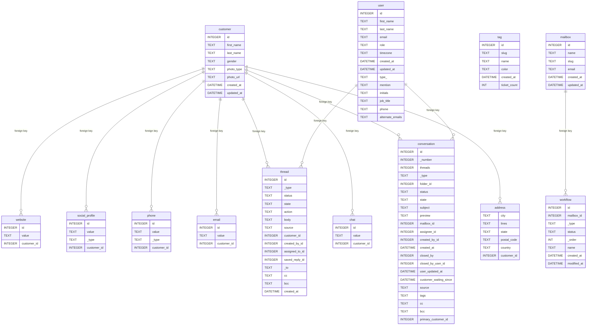

# helpscout-export

I wanted to export all my Help Scout data to a SQLite database. I searched and couldn't find anything that did this well, so I wrote it myself.

To run this script, create a new App via "Profile" > "My Apps" > "Create My App". Give it a name and a redirection URL (can be anything). Once the app is created, export `HELPSCOUT_APP_ID` and `HELPSCOUT_APP_SECRET` in your shell, then run the following to download all your data.

```
make install-dependencies
make download
```

All of your Help Scout data will be downloaded to a directory named `data/`. To import this data into a SQLite database, run this next:

```
make import
```

This will import all of the downloaded data to a SQLite file in the directory (`helpscout.db`).

Here's the ER diagram:


